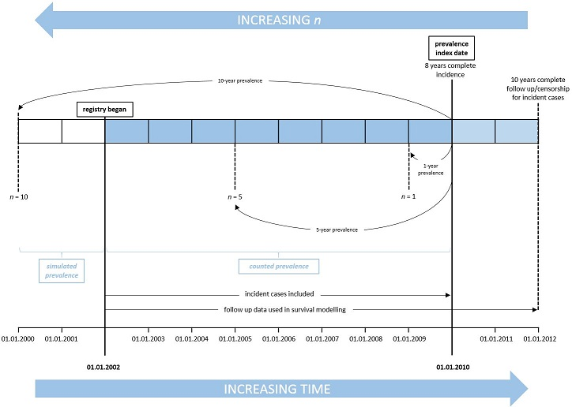

In this vignette we are going to demonstrate how predictions of prevalence are calculated from a synthetic patient dataset using `prevR`. We use the term prevalence to mean estimates of point prevalence of a disease at an index date calculated from incidence and modelled survival probability from registry data. Where we calculate prevalence for a specific number of years, *n* years, this means the number of years working back from the index date for which we have included incident cases in the prevalent pool. Therefore, the higher the value of *n*, the more incident cases are included. If *n* is greater than the number of registry years for which we have real patient data, then the contribution for the years preceding the registry back to *n* years is estimated using Monte Carlo simulation. This is illustrated in the diagram below:



As prevalence is estimated for the simulated years using probability of survival from the disease, modelled on the available registry data, an appropriate value of *n* should be selected. If *n* is too low, the prevalence prediction will be an underestimate, as long-surviving cases may exist that were incident before *n* years preceding the index date. If *n* is too high relative to the length of the registry, the longer the simulation and the greater the reliance on extrapolation from the registry data. If the disease of interest is rapidly fatal or the registry is sufficiently long that survival is accurately modelled on the available data, larger values of *n* might be appropriate. It is necessary to keep in mind that, as survival is presently modelled with an asymptotic Weibull distribution, some long-surviving cases may appear to be immortal. To overcome the problem of extrapolating the survival of these patients, we recommend implementing our so-called *cure* model, which we will discuss in more detail later in this vignette. In short, the higher the value of *n*, the more accurate the prevalence prediction, as long as survival can be adequately modelled over *n* years from the available registry data. 

In the following sections we aim to take the user through the successive stages of the modelling process, outlining the correct use of the basic functions, illustrating how the diagnostics provided are used to check the validity of the assumptions required for simulating years of interest before the registry, and checking the agreement between observed and simulated prevalence estimates. First, we will inspect the consistency of incidence data between years of the registry and determine if it can be appropriate modelled as an homogeneous Poisson process. Secondly, we will look at the consistency of the survival data between years of the registry and check the adequacy of a parametric model of survival. We will also introduce the population survival data and explain how it integrates with patient survival to produce a *cure* model, where it is desired. Lastly, we will introduce our functions for estimating prevalence, demonstrate how to check the resulting estimates are reasonable, and harvest the posterior distribution of a modelled covariate.

```{r, echo = FALSE, message = FALSE}
devtools::load_all()
```

# Basic setup and summary of data

```{r setup, message = FALSE, warning = FALSE}
library(prevR)
library(survival)
data(prevsim)
```

*prevsim* is a dataset that has been synthesised to resemble disease registry data. Incident cases are recorded from `r min(prevsim$entrydate)` to `r max(prevsim$entrydate)`, and events occur between `r min(prevsim$eventdate)` and `r max(prevsim$eventdate)`. It has 6 columns and is organised in a fashion typical to that found in real registry datasets. Patient data includes the date of both entry into the registry and last known event (be it death or a censored event time); survival time and an event indicator (*status*), along with both age and sex. The latter two are incorporated into the prevalence model at several levels, from being used as covariates in the survival modelling, and marking the incidence Poisson process. Currently `prevR` does not support the inclusion of additional variables in either the survival or incidence models, although this feature will be introduced in a later release.

```{r}
summary(prevsim)
```

The following plot shows the survival characteristics of the included dataset, *prevsim*, where, typical of many diseases, males have poorer survival outcomes than females. The Kaplan-Meier plot also highlights that survival starts to level off after 2000 days, leading us to assume a *cure model* for this dataset whereby a patient is considered cured after five years with the disease. At this point, their survival probability is instead modelled by population mortality rates. `prevR` includes data from the Office of National Statistics (ONS) to describe UK mortality rates (in dataset `UKmortality`), however, the user may supply their own population mortality data.

```{r basicsurvival, fig.height=4, fig.width=7}
survf <- survfit(Surv(time, status) ~ sex, data=prevsim)
plot(survf, lwd=2, col = c(1:2), xlab="Days", ylab="Probability")
legend(3000, 1, c("Males", "Females"), lty = 1, col=c("blue","red"))
```

# Incidence

The simulation of incident cases in the years for which registry data is not available relies upon the assumption of a homogeneous Poisson process. The package includes several functions for inspecting the incidence data, as well as diagnosing the validity of the Poisson fit.

The `incidence` function calculates absolute disease incidence for each selected year of the registry; the optional arguments *start* and *num_reg_years* allow for the specification of certain years. These are useful when there are doubts about the accuracy of the incidence data, e.g. during the first year of operation of the registry. The output is a vector of *num_reg_years* length, detailing the number of incident cases in the registry at yearly intervals starting at `start` date. For example, in the following output, the incidence between 2004-01-30 and 2005-01-30 is `r incidence(prevsim$entrydate, start="2004-01-30", num_reg_years=1)`.

```{r totalincidence, error = TRUE}
raw_incidence <- incidence(prevsim$entrydate, start="2004-01-30", num_reg_years=9)
raw_incidence
```

It can be concluded that the disease has around 100 new cases each year. To assess consistency of the incidence data with an homogeneous Poisson process, the `test_poisson_fit`, `inspect_incidence`, and `poisson_incidence_sim` functions can be used.

`test_poisson_fit` outputs the p-values for testing whether the process is over or underdispersed:
**Is this precisely what they are?**

```{r}
test_poisson_fit(raw_incidence)
```

`inspect_incidence` and `poisson_incidence_sim` are both graphical means of validating the Poisson fit, and are methods of a `cincidence` object, for which the constructor is `cumulative_incidence`. This latter function calculates cumulative incidence for the registry data and fits a spline to it.

```{r}
c_inc <- cumulative_incidence(prevsim$entrydate, start = "2004-01-30", num_reg_years = 9)
summary(c_inc)
```

`inspect_incidence` displays a plot of the actual incidence rate as recorded in the registry, with the smooth overlaid. 
**How to determine if Poisson is a good fit based on this?**

```{r, fig.width = 7, fig.height = 4}
inspect_incidence(c_inc)
```

`poisson_incidence_sim` simulates a large number of incident case datasets, where the incident cases are randomly uniformly distributed between the start and end date of the original registry. Smooths are then fitted to these datasets. For both the smooth from the `cincidence` object and the simulated smooths, the deviations from the actual data are calculated. The deviations of the simulated smooths are plotted in grey, while the deviation from the actual smooth is displayed in red, with confidence intervals in grey.

For a homogeneous incidence process, the deviation from the smooths will be normally distributed, and so this plot expects to see evidence of this if the assumption is met:

**Is this a correct summary? How to use this for diagnostic purposes?**

```{r, fig.width = 7, fig.height = 4}
poisson_incidence_sim_gg(c_inc)
```

Currently, the incidence process can only be modelled as a Poisson homogeneous process; if the diagnostics indicate this is not a suitable fit then the prevalence estimates will be inaccurate. Future releases of `prevR` will allow for custom incidence distributions.

There are other functions to describe the incident cases, such as `incidence_age_distribution` and `mean_incidence_rate`. The former simply plots the distribution of incident cases by age:

```{r incidenceage, fig.width = 7, fig.height = 4, error = TRUE}
prevsim_r <- prevsim[prevsim$entrydate >= "2004-01-30", ]

incidence_age_distribution(prevsim_r$age)
```

To calculate the mean incidence rate per 100,000 within the study population `mean_incidence_rate` is used, which requires an estimate of the size of the population at risk. The function provides confidence intervals at the specified level (default is 95%):
  
```{r incidencerate, error = TRUE}
mean_incidence_rate(prevsim$entrydate, population_size = 3.5e6,
                    start = "2004-01-30", num_reg_years = 9)
```

# Survival modelling

The second component to the prevalence estimation is the survival modelling process. It is recommended that the user inspects the survival data for consistency between years of the registry and with a Cox Proportional Hazards model as follows:

**How do these plots show that?, what are the CIs, the colours, the smooths etc... all showing?**

It is always useful to plot the Kaplan-Meier estimator of the data, both as a whole and stratified by age to visually inspect for any inconsistencies.

```{r survivaldiag, fig.width = 7, fig.height = 4}
km <- survfit(Surv(time, status) ~ 1, data=prevsim_r)
plot(km, lwd=2, col="blue", xlab="Days", ylab="Survival probability")
```

```{r survivaldiag2, fig.width = 7, fig.height = 4}
ages = c(55, 65, 75, 85, 100)
km2 <- survfit(Surv(time, status) ~ cut(age, breaks=ages), data=prevsim_r)
plot(km2, lwd=2, col=1:length(ages), xlab="Days", ylab="Survival probability")
```

**Why is Cox model fit here, not Weibull since that's what we use?**

The effect of age on hazard can be visualised to determine if there are any non-linear effects:

**What exactly is this plot of?!**

```{r survivaldiag3, fig.width = 7, fig.height = 4}
cx <- coxph(Surv(time, status) ~ age, data=prevsim_r)
cxp <- survfit(cx, 
               newdata=data.frame(age=sapply(seq(length(ages) - 1), 
                                             function(i) mean(c(ages[i], ages[i + 1]))))) 
plot(cox.zph(cx))
lines(cxp, lwd=2, col=1:length(ages), lty=2, mark.time=F)

```

It is always essential to test the proportional hazards assumption:

**Does the Weibull AFT parameterisation in `survreg` need the PH assumption to be met?**

```{r}
cox.zph(cx)
```

It is also a useful diagnostic aid to plot the survival curve for each year of the registry to determine whether there are any patterns:

```{r survivaldiag4, fig.width = 7, fig.height = 4, results='hide'}
plot(km, lwd=2, col="blue", mark.time=F, conf.int=T, xlab="Days", ylab="Survival probability")
num_reg_years <- 9
registry_years <- determine_registry_years(start='2004-01-30', num_reg_years=num_reg_years)
sapply(seq(num_reg_years),
       function(i) lines(survfit(Surv(time, status) ~ 1, 
                                 data=prevsim_r[prevsim_r$entrydate >= 
                                                          registry_years[i] & 
                                                          prevsim_r$entrydate < 
                                                          registry_years[i + 1], ]), 
                         mark.time = F, conf.int = F))
```

## Functional form of age

`functional_form_age()` is provided so that the user can determine if modelling the effect of age as linear is appropriate. This function fits a Cox model to the data with a restricted cubic spline with the specified degrees of freedom. The model is returned by the function (as an `rms::cph object`, allowing the user to inspect the fit. The function can also plot relative hazard as a function of age with the `plot_fit` argument.

**is this what is being plotted? Never used Predict function before**

**How is this different to the third plot in survival modelling above? **

```{r ageform2, fig.width = 7, fig.height = 4, error = TRUE}
functional_form_age(Surv(time, status) ~ age, prevsim_r, df=4, plot_fit=T)
```

## Weibull model

Survival is modelled in the prevalence estimations using a Weibull distribution. Currently, there is no flexibility to how this model is fitted, it defaults to using both age and sex. It is therefore important to manually verify that this is an appropriate model.

```{r weibull, error = TRUE}
wb <- survreg(Surv(time, status) ~ age + sex, data=prevsim_r)
summary(wb)
```

## Population survival

As an alternative to extrapolation from the Weibull model alone when modelling long-term survivors in patient data, we have implemented what we call a cure model. For example, the default `cure = 10` in the following functions for estimating prevalence, means a patient can be considered "cured" if they have survived until 10 years after diagnosis, and therefore from this point onwards their survival is modelled using population data rather than patient data. This requires having population level daily mortality rate data.

General population period survival data for the UK is loaded from the supplied `UKmortality` dataset, and yearly rates are translated into daily rates by linear interpolation using `population_survival_rate()`. 

```{r popsurv, fig.width = 7, fig.height = 4, error = TRUE}
data(UKmortality)

daily_survival_males <- population_survival_rate(rate ~ age, subset(UKmortality, sex == 0))
daily_survival_females <- population_survival_rate(rate ~ age, subset(UKmortality, sex == 1))

plot(daily_survival_males, type="l", col="blue", xlab="days", ylab="survival")
lines(daily_survival_females, col="red")
legend("topright", legend = c("Males", "Females"),
               bty = "n", lty = 1, col = c(4,2))
```

# Prevalence estimates

As a reminder, prevalence is estimated using incidence and survival data from *n* years, the larger *n*, the more accurate the estimate. However, registry data (and thus known incidence and survival) data may only be known for *r* years, where *r* <= *n*. If *r* < *n*, the remaining *n*-*r* years of incidence and survival are simulated using Monte Carlo techniques.

## Counts

In the first instance, prevalence can be estimated by counting from the registry data. It is imperative that the number of incident cases is complete for estimating prevalence, and that follow-up data for all cases is complete at least until after the index date. In the case of the provided *prevsim* dataset there is a discrepency between the last recorded incident case and the last date of follow-up owing to a systematic difference in methods of incidence and survival data collection, as is typically the case in registry datasets where incidence and follow-up data are provided by different sources.

`prevalence_counted` calculates prevalence contributions for each year of the provided registry data, specified using the `start` and `num_reg_years` arguments. In the example shown below, `r tail(determine_registry_years(start='2004-01-30', num_reg_years=9), n=1)` is the index date. This is calculated to be the last date of the last year of registry data included by the user. In `prevalence_counted()`, all cases alive after the index date are censored. 

NB: all follow-up data for the available incident cases is still used in survival modelling.

```{r survival, error = TRUE}
prevalence_counted(prevsim$entrydate, 
                   prevsim$eventdate, 
                   prevsim$status, 
                   start="2004-01-30", 
                   num_reg_years=9)
```

The function returns the prevalence contributions by year, in ascending order (i.e there are 44 contributions from the year between 2004-01-30 and 2005-01-30).

## Simulation

Prevalence is estimated using simulation by calling `prevalence()`. `num_years_to_estimate` corresponds to the number of years preceding the index date that contribute incident cases, if any values are larger than `num_reg_years` then the remainder of years have their incidence and survival characteristics simulated. By passing a vector to `num_years_to_estimate`, multiple estimates of prevalence at the index date can be calcualted with their own confidence intervals. The `population_size` variable is used to estimate prevalence per one hundred thousand (or at any rate specified by the `proportion` argument).

```{r prevalencetotal, error = TRUE}
prevalence_total <- prevalence(Surv(time, status) ~ sex(sex) + age(age) + entry(entrydate) + event(eventdate),
                               prevsim, num_years_to_estimate=c(3, 5, 10), population_size=1e6, cure=5, 
                               start='2004-01-30', num_reg_years=9)

prevalence_total
```

Printing the `prevalence` object returned by the function of the same name displays the point estimate of prevalence at the index date using `num_years_to_estimate` years of data.

```{r}
summary(prevalence_total)
``` 

Confidence intervals can be found from within the object's `estimates` attribute.

```{r}
prevalence_total$estimates
```

## Inspecting bootstrapped survival modelling

To inspect the suitability of the bootstrapped survival modelling, a `survfit.prev` object can be constructed using the usual `survfit` call, excepting a data frame of new data (with identical column names to those found in the original dataset). In the example below, survival probability is estimated for a 60 year old male.

```{r}
prevsurv <- survfit(prevalence_total, newdata=list(age=60, sex=0))
prevsurv
```

The `summary.survfit.prev` method provides *N*-year survival probabilities, with *N* specified as an argument vector.

```{r}
summary(prevsurv, years=c(1, 3, 5, 10))
```

Plotting the `survfit.prev` object displays the survival curve of a Weibull model using the original dataset (orange), along with 95% confidence intervals derived using the bootstrapped models shaded in light grey, while outlier curves are individually plotted. Outliers are defined as those survival curves where at least `pct_show` proportion of their point predictions lie outside the 95% confidence interval.

```{r, fig.width=7, fig.height=4}
plot(prevsurv, pct_show=0.90)
```

## Comparison between simulated and counted prevalence

Whether the model is predicting good numbers for the recent years for which we have data can be assessed using a chi squared test. `test_prevalence_fit` is a method of a `prevalence` object which calculates the chi-square test between the number of simulated prevalent contributions and those counted in the years for which registry data is available.

```{r test, error = TRUE}
test_prevalence_fit(prevalence_total)
```

For this model, there is no evidence to reject the null hypothesis.

## Age distribution of prevalent cases

The age distribution of simulated prevalent cases can be viewed as a histogram and compared with the age distribution of incident cases:

```{r, fig.height = 4, fig.width = 7}
hist(prevsim$age[prevsim$entrydate >= min(registry_years) & prevsim$entrydate < max(registry_years)], 
     col=rgb(1,0,0, alpha=0.5), xlim=c(0,100), ylim=c(0,0.045), 
     main = "", xlab = "age", prob = TRUE)
hist(prevalence_total$simulated$posterior_age, 
     col=rgb(0,1,0, alpha=0.5), prob = TRUE, add=T)
legend("topleft", legend = c("Incident", "Prevalent"), bty = "n", lty = 1, 
       col = c(rgb(1,0,0, alpha=0.5),
               rgb(0,1,0, alpha=0.5)))
```