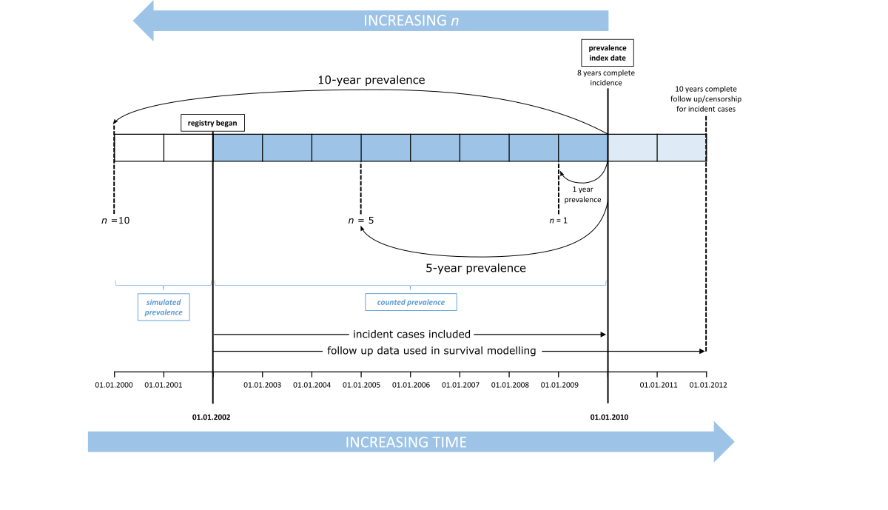

# Introduction

In this vignette we are going to demonstrate how predictions of disease prevalence are calculated from a synthetic patient data set using `rprev`. We define the term **prevalence** as *"point estimates of disease prevalence at a specific index date"*. This is typically estimated from incidence and modelled survival probability using registry data. Following the methodology of [@crouch2014determining], which has been employed in published work [@roman2016myeloid, @smith2015lymphoma], we calculate prevalence for *n* years, with *n* defined as the number of years prior to the index date for which we have included incident cases in the prevalent pool. In other words, prevalence estimates consider only those diagnosed in the preceding *n* years. Therefore, the higher the value of *n*, the more incident cases are included. If *n* is less than or equal to the number of registry years, then the prevalence estimate is made by simply counting those remaining in the prevalent pool at the index date. If *n* is greater than the number of registry years for which we have real patient data, then the contribution for the years preceding the registry back to *n* years is estimated using Monte Carlo simulation. This is illustrated in the diagram below:

<div style="text-align:center" markdown="1">



</div>

Throughout we assume that a patient diagnosed with a particular disease remains prevalent while they are still alive. If time to death is replaced with "time to removal from prevalent pool" in the survival modelling, then estimates corresponding to this notion of prevalence can be made.

As prevalence is estimated for the simulated years using probability of survival from the disease modelled on the available registry data, an appropriate value of *n* should be selected. If *n* is too low, the prevalence prediction will be an underestimate, as long-surviving cases may exist that were incident before *n* years preceding the index date. If *n* is too high relative to the length of the registry, the longer the simulation and the greater the reliance on extrapolation outside the registry data. If the disease of interest is rapidly fatal or the registry is sufficiently long that survival is accurately modelled on the available data, larger values of *n* might be appropriate. It is necessary to keep in mind that, as survival is presently modelled using Weibull regression, some long-surviving cases may appear to be immortal. To overcome the problem of extrapolating the survival of these patients, we recommend implementing our so-called *cure* model, which we will discuss in more detail later in this vignette. In short, the higher the value of *n*, the more accurate the prevalence prediction, as long as survival can be adequately modelled over *n* years from the available registry data. 

In the following sections we aim to take the user through the successive stages of the modelling process, outlining the correct use of the basic functions, illustrating how the diagnostics provided are used to check the validity of the assumptions required for simulating years of interest before the registry, and checking the agreement between observed and simulated prevalence estimates. First, we will inspect the consistency of incidence data between years of the registry and determine if it can be appropriately modelled as an homogeneous Poisson process. Second, we will look at the consistency of the survival data between years of the registry and check the adequacy of a parametric model of survival. We emphasise that the user should check that their registry data does meet the required assumptions and if not, should understand that estimates of prevalence made using simulation based on that data may not be correct. Then, we will also introduce the population survival data and explain how it integrates with patient survival to produce a *cure* model, where it is desired. Lastly, we will introduce our functions for estimating prevalence, demonstrate how to check the resulting estimates are reasonable, and extract the posterior distribution of a modelled covariate.

# Basic setup and summary of data

```{r setup, message = FALSE, warning = FALSE}
library(rprev)
library(survival)
data(prevsim)
```

*prevsim* is a data set that has been synthesised to resemble disease registry data. Incident cases are recorded from 2003-01-01 to 2013-01-30, and events occur between `r min(prevsim$eventdate)` and `r max(prevsim$eventdate)`. It has 6 columns and is organised in a fashion typical to that found in real registry data sets. Patient data includes the date of both entry into the registry and last known event (be it death or a censored event time), survival time and an event indicator (*status*) along with both age and sex. The latter two are incorporated into the prevalence model at several levels, from being used as covariates in the survival modelling, and marking the incidence Poisson process [see @crouch2014determining]. Currently `rprev` does not support the inclusion of additional variables in either the survival or incidence models, although this feature will be introduced in a later release.

```{r}
summary(prevsim)
```

The following Kaplan-Meier plot shows the survival probabilities associated with the included data set, *prevsim*, where, typical of many diseases, males have poorer survival outcomes than females. It also highlights that survival starts to level off after 2000 days. As our registry is short relative to the duration of survival from this disease, we do not have much information about long-term survival after this point in our patient population in order to base a model. In this scenario, instead of extrapolating survival (and thus risking the problem of "immortal" subjects), we recommend using general population survival data to model long-term survivors, and we refer to this as a *cure model* [@crouch2014determining]. In this model, after a specified "cure time", surviving subjects are considered to revert to the survival characteristics for someone of their age and sex in the general population. In our example, a patient is considered *cured* after five years survival with the disease.

Until the point in time that the cure model takes effect, survival is modelled on disease registry data; after this time, survival probability for the surviving cases is modelled using population mortality rates. `rprev` includes data from the Office of National Statistics (ONS) [see @ons, data licenced under the Open Government Licence v3.0] to describe UK mortality rates (in data set `UKmortality`), however, the user may supply their own population mortality data. 

```{r basicsurvival, fig.height=4, fig.width=7}
survf <- survfit(Surv(time, status) ~ sex, data=prevsim)
plot(survf, lwd=1, col = c("blue","red"), main="Survival stratified by sex", xlab="Days", 
     ylab="Probability")
legend(3000, 1, c("Males", "Females"), lty = 1, col=c("blue","red"))
```

# Incidence

The simulation of incident cases in the years for which registry data is not available currently assumes that the incidence process is homogeneous Poisson. The package includes several functions for inspecting the incidence data, as well as diagnosing the validity of this assumption.

The primary function is `incidence`, which calculates several summary statistics of the disease incidence. It requires a vector of entry dates into the registry, along with the size of the population under consideration. The registry under interest can be subset to only count incident cases from specific years of interest, useful if there are doubts about the accuracy of the data, for example during the first year of operation. This function also fits a spline smooth to the incidence rate data.

```{r}
inc <- incidence(prevsim$entrydate, population_size=3.2e6, start='2005-09-01', num_reg_years=5)
```

This function returns an S3 object of class `incidence` with the following attributes.

```{r}
inc
names(inc)
```

The `summary.incidence` method displays the most useful information about the incidence process of the disease of interest.

```{r}
summary(inc)
```

The known yearly incidence rates are displayed starting at `start` date for `num_reg_years`, starting with the first year. For the simulated data set `prevsim`, there were 96 incident cases between 2005-09-01 and 2006-09-01. It can be concluded that the disease has around 100 new cases each year.

Below that is a summary of the cumulative diagnosis times (in days), useful as a quick check of the distribution of incident cases. The p-values of a simulation test indicating whether the yearly incidence estimates are under or over dispersed relative to a homogeneous Poisson process are also displayed. Inspection of the smoothed incidence function should reveal whether the problem is one of non-homogeneity (which may lead to inaccurate prevalence estimates) or of failure of the Poisson assumption (which may lead to inaccurate estimates of confidence intervals). 

Another useful incidence statistic is the mean incidence rate per 100,000 within the study population, which is obtained from the `mean` attribute. Confidence intervals are provided at the specified level (default is 95%):
  
```{r incidencerate, error = TRUE}
inc$mean
```

Alongside the p-values from the over/under dispersion test, `rprev` provides visual tools to assess the consistency of the incidence data with an homogeneous Poisson process.

`plot.incidence` displays a plot of the actual incidence rate as recorded in the registry, with the smooth overlaid. If incidence is an homogeneous Poisson process, both the smooth (green) and incidence process (red) should remain within the 95% confidence interval (dashed blue) and be evenly distributed about the mean (blue line). 

```{r, fig.width = 7, fig.height = 4}
plot(inc)
```

Currently, the incidence process can only be modelled as a Poisson homogeneous process; if the diagnostics indicate this is not a suitable fit then the prevalence estimates (or their confidence intervals) will be unreliable. Future releases of `rprev` will allow for custom incidence processes.

Another function used to describe the incident cases is `incidence_age_distribution`, which simply plots the distribution of incident cases by age.

```{r incidenceage, fig.width = 7, fig.height = 4, error = TRUE}
prevsim_r <- prevsim[prevsim$entrydate >= "2004-01-30", ]

incidence_age_distribution(prevsim_r$age)
```


# Survival modelling

The second component to the prevalence estimation is the survival modelling process. Survival is currently modelled using a parametric Weibull model with age and sex as covariates. It is recommended that the user inspects the survival data for consistency with the assumptions of this model and for homogeneity:

First, it is always useful to plot the Kaplan-Meier estimator of the data, both as a whole and stratified by age to visually inspect for any inconsistencies:

```{r survivaldiag, fig.width = 7, fig.height = 4}
km <- survfit(Surv(time, status) ~ 1, data=prevsim_r)
plot(km, lwd=2, col="blue", main="Overall Survival", xlab="Days", 
     ylab="Survival probability")
```

```{r survivaldiag2, fig.width = 7, fig.height = 4}
ages = c(55, 65, 75, 85, 100)
km2 <- survfit(Surv(time, status) ~ cut(age, breaks=ages), data=prevsim_r)
plot(km2, lwd=2, col=1:length(ages), main="Survival stratified by age", xlab="Days", 
     ylab="Survival probability")
legend("topright", legend=substring(names(km2$strata), 25, 32), lty = 1, 
       col=1:length(ages))
```

It is also a useful diagnostic aid to plot the survival curve for each year of the registry to determine whether there is any inhomogeneity:

```{r survivaldiag4, fig.width = 7, fig.height = 4, results='hide'}
plot(km, lwd=2, col="blue", mark.time=F, conf.int=T, xlab="Days", 
     ylab="Survival probability")
num_reg_years <- 9
registry_years <- determine_registry_years(start='2004-01-30', 
                                           num_reg_years=num_reg_years)
sapply(seq(num_reg_years),
       function(i) lines(survfit(Surv(time, status) ~ 1, 
                                 data=prevsim_r[prevsim_r$entrydate >= 
                                                          registry_years[i] & 
                                                          prevsim_r$entrydate < 
                                                          registry_years[i + 1], ]), 
                         mark.time = F, conf.int = F))
```

The effect of age on hazard can be visualised to determine if there are any non-proportional effects, by inspecting Schoenfeld residuals from a Cox model. This is easily done using the `cox.zph` function from the `survival` package. 

```{r survivaldiag3, fig.width = 7, fig.height = 4}
cx <- coxph(Surv(time, status) ~ age, data=prevsim_r)
cxp <- survfit(cx, 
               newdata=data.frame(age=sapply(seq(length(ages) - 1), 
                                             function(i) mean(c(ages[i], ages[i + 1]))))) 
plot(cox.zph(cx))
lines(cxp, lwd=2, col=1:length(ages), lty=2, mark.time=F)

```

An overall test of the proportional hazards assumption may be made.

```{r}
cox.zph(cx)
```

## Functional form of age

`functional_form_age()` is provided so that the user can further investigate if modelling the effect of age as linear is appropriate. This function fits a Cox model to the data with a restricted cubic spline with the specified degrees of freedom. The model is returned by the function as an `rms::cph object`, allowing the user to inspect the fit. The function can also plot relative hazard as a function of age with the `plot_fit` argument.

```{r ageform2, fig.width = 7, fig.height = 4, error = TRUE}
functional_form_age(Surv(time, status) ~ age, prevsim_r, df=4, plot_fit=T)
```

## Weibull model

Survival is modelled in the prevalence estimations using Weibull regression. Currently, there is no flexibility to how this model is fitted, it defaults to using both age and sex. It is therefore important to manually verify that this is an appropriate model.

```{r weibull, error = TRUE}
wb <- survreg(Surv(time, status) ~ age + sex, data=prevsim_r)
summary(wb)
```

## Population survival

For modelling long-term survivors in registry data, we have implemented a *cure* model option. For example, the default `cure = 10` in the following functions for estimating prevalence, means a patient can be considered "cured" if they have survived until 10 years after diagnosis, and therefore from this point onwards their survival is modelled using population survival rather than cohort survival. 

General population period survival data for the UK is loaded from the supplied `UKmortality` data set, and yearly rates are translated into daily rates by linear interpolation using `population_survival_rate()`. 

```{r popsurv, fig.width = 7, fig.height = 4, error = TRUE}
data(UKmortality)

daily_survival_males <- population_survival_rate(rate ~ age, subset(UKmortality, 
                                                                    sex == 0))
daily_survival_females <- population_survival_rate(rate ~ age, subset(UKmortality, 
                                                                      sex == 1))

plot(daily_survival_males, type="l", col="blue", xlab="days", ylab="survival")
lines(daily_survival_females, col="red")
legend("topright", legend = c("Males", "Females"),
               bty = "n", lty = 1, col = c(4,2))
```

# Prevalence estimates

As a reminder, prevalence is estimated using incidence and survival data from *n* years. However, registry data (and thus known incidence and survival) data may only be known for *r* years, where *r* <= *n*. If *r* < *n*, the remaining *n*-*r* years of incidence and survival are simulated using Monte Carlo techniques.

## Counts

In the first instance, prevalence can be estimated by counting from the registry data. It is imperative that the number of incident cases is complete for estimating prevalence, and that follow-up data for all cases is complete at least until after the index date. In the case of the provided *prevsim* data set the last recorded incident case date and the last date of follow-up are different, as is typically the case in registry data sets where incidence and follow-up data are provided by different sources.

`prevalence_counted` calculates prevalence contributions for each year of the provided registry data to the index date - specified using the `index_date` argument. The `num_reg_years` parameter allows the user to specify the number of years of data to use in the estimation, in the example below incident cases from the first year of the registry in 2003 are discarded due to concerns about their accuracy. In `prevalence_counted()`, all cases alive after the index date are censored. 

```{r survival, error = TRUE}
prevalence_counted(prevsim$entrydate, 
                   prevsim$eventdate, 
                   prevsim$status, 
                   index_date="2013-01-30",
                   num_reg_years=9) 
```

The function returns the prevalence contributions by year, in ascending order (i.e there are 44 contributions from the year between 2004-01-30 and 2005-01-30).

## Simulation

Prevalence is estimated using simulation by calling `prevalence()`. `index_date` and `num_reg_years` perform the same role as in `prevalence_counted`: specifying the date at which to estimate point prevalence, and allowing for the specification of the number of years of registry data to use. `num_years_to_estimate` corresponds to the required number of years preceding the index date that contribute incident cases. If any values are larger than the number of complete years of registry data available before `index_date`, then the remainder of years have their incidence and survival characteristics simulated. By passing a vector to `num_years_to_estimate`, multiple estimates of prevalence at the index date can be calculated with their own confidence intervals. The `population_size` variable is used to estimate prevalence per one hundred thousand (or at any rate specified by the `proportion` argument).

NB: all follow-up data for the available incident cases is still used in survival modelling.

```{r prevalencetotal, error = TRUE}
prevalence_total <- prevalence(Surv(time, status) ~ sex(sex) + age(age) + 
                                   entry(entrydate) + event(eventdate),
                               prevsim, num_years_to_estimate=c(3, 5, 10), 
                               population_size=1e6, 
                               index_date='2013-01-30',
                               num_reg_years=9, cure=5) 
```

Printing the `prevalence` object returned by the function of the same name displays the point estimate of prevalence at the index date using `num_years_to_estimate` years of data:

```{r}
prevalence_total
```

More detail from the `prevalence` object can be extracted using `summary`, including the p-value from a chi squared test of the difference between the predicted and counted prevalence for the available years of registry data:

```{r}
summary(prevalence_total)
``` 

The prevalence object's `estimates` attribute holds the point prevalence estimate along with rates per one hundred thousand and confidence intervals. As *n* increases, the prevalence estimate increases:

```{r}
prevalence_total$estimates
```

## Inspecting bootstrapped survival modelling

To inspect the distribution of the bootstrapped survival models [see @crouch2014determining for details], a `survfit.prev` object can be constructed using the usual `survfit` call, accepting a data frame of new data (with identical column names to those found in the original data set). In the example below, survival probability is estimated for a 60 year old male:

```{r}
prevsurv <- survfit(prevalence_total, newdata=list(age=60, sex=0))
prevsurv
```

The `summary.survfit.prev` method provides *N*-year survival probabilities, with *N* specified as an argument vector:

```{r}
summary(prevsurv, years=c(1, 3, 5, 10))
```

Plotting the `survfit.prev` object displays the survival curve of a Weibull model using the original data set (orange), along with 95% confidence intervals derived using the bootstrapped models shaded in light grey, while outlier curves are individually plotted. Outliers are defined as those survival curves where at least `pct_show` proportion of their point predictions lie outside the 95% confidence interval.

```{r, fig.width=7, fig.height=4}
plot(prevsurv, pct_show=0.90)
```

## Comparison between simulated and counted prevalence

As a test of whether the model is predicting reasonable values of prevalence, we can use the fact that we can directly measure the discrepancy between the predicted and actual prevalence for the available registry years. This difference can be formally tested using a chi-square test; the resulting p-value resulting is returned as an attribute of a `prevalence` object, called `pval`.

```{r}
prevalence_total$pval
```

For this model, there is no evidence to reject the null hypothesis.

This can also be calculated manually with the `test_prevalence_fit` function.

```{r test, error = TRUE}
test_prevalence_fit(prevalence_total)
```

## Age distribution of prevalent cases

The age distribution of simulated prevalent cases can be viewed as a histogram and compared with the age distribution of incident cases:

```{r, fig.height = 4, fig.width = 7}
hist(prevsim$age[prevsim$entrydate >= min(registry_years) & 
                     prevsim$entrydate < max(registry_years)], 
     col=rgb(1,0,0, alpha=0.5), xlim=c(0,100), ylim=c(0,0.045), 
     main = "", xlab = "age", prob = TRUE)
hist(prevalence_total$simulated$posterior_age, 
     col=rgb(0,1,0, alpha=0.5), prob = TRUE, add=T)
legend("topleft", legend = c("Incident", "Prevalent"), bty = "n", lty = 1, 
       col = c(rgb(1,0,0, alpha=0.5),
               rgb(0,1,0, alpha=0.5)))
```

# References
